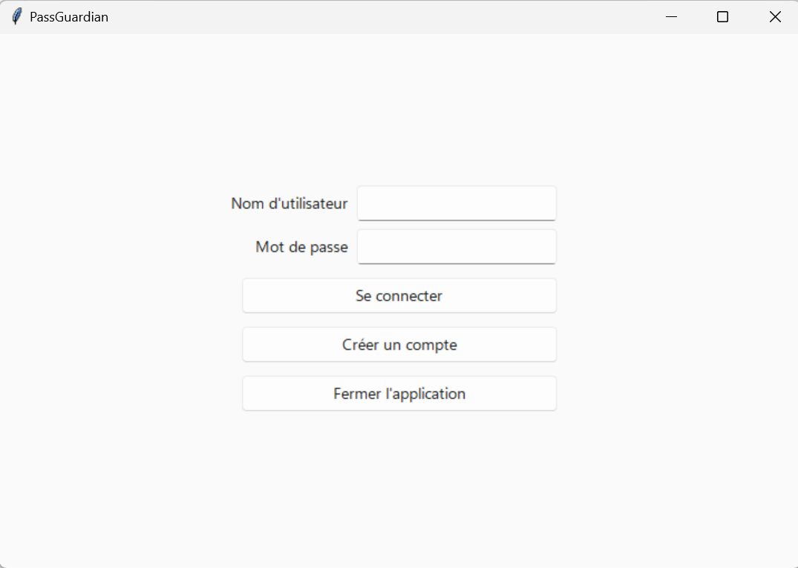
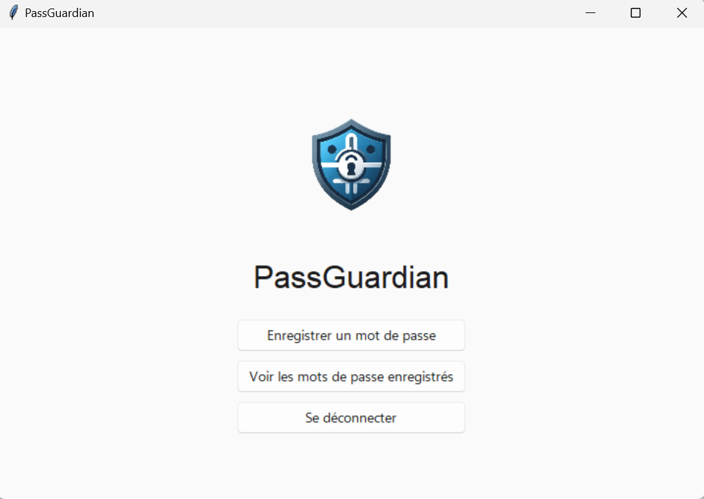

># PassGuardian

>

>Un gestionnaire de mots de passe simple et sécurisé.

## Fonctionnalités

- Stockage de mots de passe.
- Génération de mots de passe.
- Affichage des mots de passe.

## Algorithme de chiffrement utilisé

Nous utilisons AES-GCM (Galois/Counter Mode). C'est un mode d'opération de chiffrement par bloc en chiffrement symétrique. Il est relativement répandu en raison de son efficacité et de ses performances. 

**Chiffrement :**  
Pour chiffrer des données, AES-GCM divise le texte en clair en blocs de taille fixe et chiffre chaque bloc en utilisant AES avec la clé secrète.

**Authentification :**  
En plus du chiffrement, GCM génère également un tag d'authentification pour chaque bloc de données chiffrées. Ce tag est calculé en utilisant une fonction de hachage spécialisée appelée le mode Galois Counter (GC). Le tag d'authentification est ajouté à la sortie chiffrée et est utilisé pour vérifier l'intégrité des données lors du déchiffrement.

**Utilisation d'un vecteur d'initialisation (IV) :**  
- Pour garantir la sécurité, chaque mot de passe chiffré nécessite un IV unique.
- L'IV est combiné avec un compteur pour produire un "IV couplé" qui est utilisé dans le processus de chiffrement.
- Cela garantit que si les mêmes données sont chiffrées plusieurs fois avec la même clé, elles produiront différentes sorties.

## Comment utiliser

1. Exécutez le fichier main.py.
2. L'application s'ouvre.
3. Créez un compte ou connectez-vous.

4. Vous pouvez maintenant ajouter des mots de passe, les afficher ou les supprimer.

## Auteurs

- Thiry Stéphane
- Mirande Clémentine
- Michelozzi Matthieu
